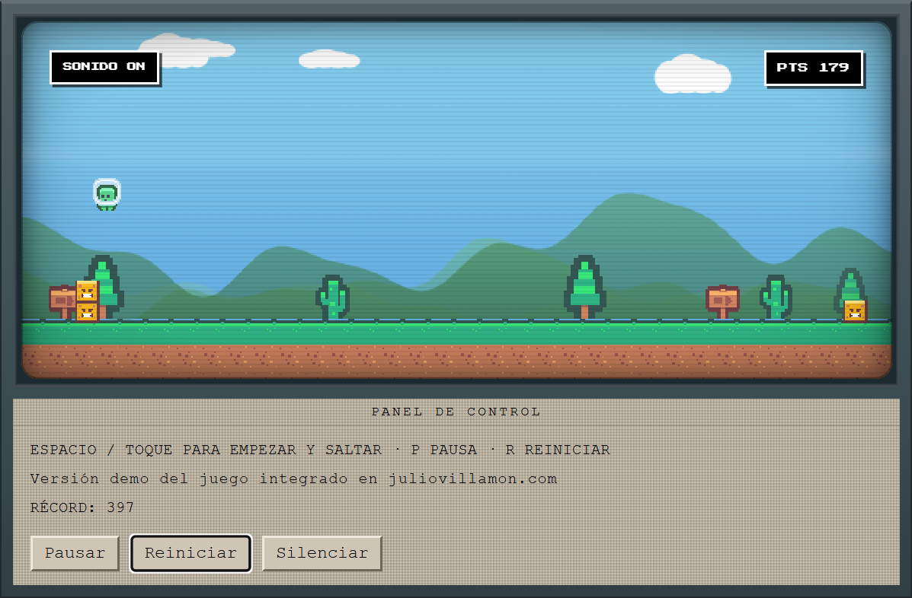

# Salto Verde

Mini juego runner en pixel art: un héroe verde con casco salta bloques apilados en un paisaje infinito mientras corre sin parar. Sin dependencias, funciona en el navegador.

**[Jugar en línea](https://www.juliovillamon.com/juego)** · Demo local: abre `index.html`



## Características

- Runner 2D en **Canvas** con física de salto y coyote time
- Sprites del pack [Kenney Pixel Platformer](https://kenney.nl/assets/pixel-platformer) (CC0)
- Música y efectos generados con **Web Audio API** (sin archivos de audio)
- Interfaz retro: HUD pixel, overlay central y efecto **CRT** (scanlines, viñeta, barra de barrido)
- Controles de **teclado y táctil** (móvil)
- Récord y preferencia de sonido en `localStorage`

## Tecnología

| Área | Detalle |
|------|---------|
| Motor | JavaScript vanilla (IIFE), ~1500 líneas |
| Gráficos | Canvas 2D + 9 PNG en `assets/` |
| Audio | Osciladores Web Audio API |
| Estilos | CSS puro (`css/game.css`) |
| Persistencia | `saltoVerdeHighScore`, `saltoVerdeMuted` |

## Cómo probarlo

Abre `index.html` en el navegador. No hace falta instalar nada.

Si los sprites no cargan con `file://` (política del navegador), sirve la carpeta con un servidor local:

```bash
python -m http.server 8765
# http://localhost:8765/
```

### Controles

| Acción | Teclado | Táctil (móvil) |
|--------|---------|----------------|
| Empezar / saltar | Espacio o ↑ | Toque en la pantalla del juego |
| Pausa | P | Botón «Pausar» |
| Reiniciar | R | Botón «Reiniciar» o toque tras game over |
| Sonido | Botón «Silenciar» | Igual |

En escritorio el salto es por teclado (Espacio o flecha ↑); en móvil el toque actúa sobre la ventana del juego (canvas + marco), no sobre el panel inferior.

## Estructura

```text
salto-verde/
├── index.html
├── LICENSE               CC0 1.0 — dominio público
├── README.md
├── favicon.png
├── screenshot.png
├── css/
│   └── game.css          Estilos, efecto CRT, HUD pixel
├── js/
│   ├── sprites.js        Cargador de PNG
│   └── game-runner.js    Motor (API SaltoVerde)
├── assets/               9 sprites usados en runtime
└── docs/
    └── ARQUITECTURA.md   Notas técnicas del motor
```

## API

```javascript
// Montar (precarga sprites y arranca el bucle)
SaltoVerde.mount(document.querySelector('.game-view'));

// Desmontar (eventos, audio, requestAnimationFrame)
SaltoVerde.destroy();

// Récord persistido
SaltoVerde.getHighScore();
```

Requisitos del DOM: ver [docs/ARQUITECTURA.md](docs/ARQUITECTURA.md).

## Licencia

**Todo el código, la documentación y el screenshot de este repositorio están en dominio público bajo [CC0 1.0](https://creativecommons.org/publicdomain/zero/1.0/).**

Puedes usarlo, copiarlo, modificarlo y redistribuirlo **sin restricciones** — incluido uso comercial. No necesitas permiso ni atribución (aunque se agradece si mencionas el proyecto).

Texto legal completo: [LICENSE](LICENSE).

### ¿Por qué CC0 y no MIT?

| Licencia | Atribución obligatoria | Copyleft | Uso comercial |
|----------|------------------------|----------|---------------|
| **CC0** | No | No | Sí |
| MIT | Sí (conservar aviso) | No | Sí |
| GPL | Sí | Sí | Sí |

Para «totalmente libre, sin ninguna restricción», **CC0** es la opción más clara: renuncia al copyright en la medida que permite la ley. Además coincide con la licencia de los sprites Kenney incluidos en `assets/`.

## Créditos de assets (Kenney)

Los PNG proceden del pack **[Pixel Platformer](https://kenney.nl/assets/pixel-platformer)** de [Kenney](https://www.kenney.nl), también bajo **CC0 1.0**. La atribución no es obligatoria.

| Archivo en `assets/` | Origen en el pack Kenney |
|----------------------|-------------------------|
| `player-run-a.png` | `Tiles/Characters/tile_0000.png` |
| `player-run-b.png` | `Tiles/Characters/tile_0001.png` |
| `player-jump.png` | `Tiles/Characters/tile_0000.png` (frame de salto) |
| `obstacle.png` | Recorte de `Tiles/Characters/tile_0012.png` |
| `ground-top.png` | `Tiles/tile_0050.png` |
| `ground-fill.png` | `Tiles/tile_0122.png` |
| `deco-tree.png` | `Tiles/tile_0126.png` |
| `deco-cactus.png` | `Tiles/tile_0127.png` |
| `deco-sign.png` | `Tiles/tile_0085.png` |

Montañas, nubes y cielo se dibujan por código (no usan PNG del pack).

## Autor

[Julio Villamón](https://www.juliovillamon.com) — también disponible en [juliovillamon.com/juego](https://www.juliovillamon.com/juego).
